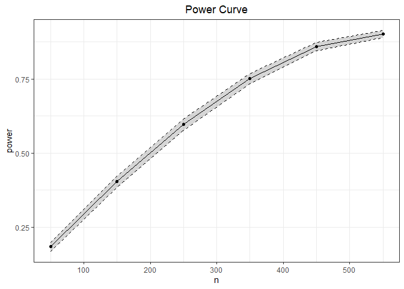
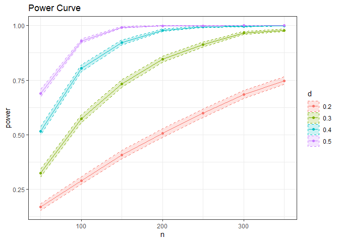

[](https://www.r-pkg.org:443/pkg/Spower)
[](https://CRAN.R-project.org/package=Spower)

# *Spower*: Power Analyses using Monte Carlo Simulations 

*Spower* Provides a general purpose simulation-based power analysis API
for routine and customized simulation experimental designs. The package
focuses exclusively on Monte Carlo simulation experiment variants of
(expected) prospective power analyses, criterion analyses, compromise
analyses, sensitivity analyses, and a priori/post-hoc analyses. The
default simulation experiment functions defined within the package
provide stochastic variants of the power analysis subroutines in
*GPower* 3.1 (Faul, Erdfelder, Buchner, and Lang, 2009), along with
various other parametric and non-parametric power analysis applications
(e.g., mediation analyses) and support for Bayesian power analysis by
way of Bayes factors or posterior probability evaluations. Additional
functions for building empirical power curves, reanalyzing simulation
information, and for increasing the precision of the resulting power
estimates are also included, each of which utilize similar API
structures. For further details see the associated publication in
Chalmers (2025).

## Installation

You can install `Spower` from CRAN:

``` r
install.packages("Spower")
```

To install the development version of the `Spower` package, you need to
install the `remotes` package then the `Spower` package.

``` r
install.packages("remotes")
remotes::install_github("philchalmers/Spower")
```

## Quick Start

*Spower* requires only two components: an available function used to
generate exactly one simulation experiment that returns one or more
*p*-values given the null hypothesis of interest (or alternative
criteria that return `logical` indicators or posterior probabilities),
and the use of either `Spower()` or `SpowerCurve()` to perform the
desired prospective/post-hoc, a priori, sensitivity, compromise, or
criterion power analysis.

For example, the built-in `p_t.test()` function performs *t*-tests using
various inputs, where below a sample size of $N=200$ is supplied
(`n = 100` per group) and a Cohen’s $d$ of .5 (a so-called “medium”
effect). This returns a single $p$-value given the null hypotheses of no
mean difference, which in this single case returns a ‘surprising’ result
given this null position tested.

``` r
library(Spower)
p_t.test(n=100, d=0.5)
## [1] 0.001231514
```

To evaluate the prospective power of this test simply requires passing
the simulation function to `Spower()`, which will perform this
experiment with 10,000 independent replications, collecting and
summarizing all relevant information for the power analysis.

``` r
set.seed(42)
p_t.test(n=100, d=0.5) |> Spower()

##
## Execution time (H:M:S): 00:00:02
## Design conditions: 
##
## # A tibble: 1 × 4
##       n     d sig.level power
##   <dbl> <dbl>     <dbl> <lgl>
## 1   100   0.5      0.05 NA   
## 
## Estimate of power: 0.943
## 95% Confidence Interval: [0.938, 0.947]
```

Alternatively, for a priori and sensitive analyses, the respective input
to the simulation function must be set to `NA`, while within `Spower()`
the target power rate must be included along with a suitable search
`interval` range. Below the target power is set to $1-\beta = .95$,
while the associated $n$ is suspected to lay somewhere within the
boundary $[50,300]$.

``` r
set.seed(01123581321)

# estimate the require n value to achieve a power of 1 - beta = .95 
p_t.test(n=NA, d=0.5) |> Spower(power=.95, interval=c(50, 300))

## Iter: 56; Median = 101; E(f(x)) = 0.00; Total.reps = 11000; k.tol = 2; Pred = 103.4
##
## Execution time (H:M:S): 00:00:05
## Design conditions: 
## 
## # A tibble: 1 × 4
##       n     d sig.level power
##   <dbl> <dbl>     <dbl> <dbl>
## 1    NA   0.5      0.05  0.95
## 
## Estimate of n: 103.4
## 95% Predicted Confidence Interval: [101.5, 105.4]
```

## Estimated power curves

To generate suitable power-curves for any given simulation or power
analysis criteria, the simulation experiment can be passed to
`SpowerCurve()` (or to `SpowerBatch()` first, and then to
`SpowerCurve()`). This function contains a similar specification
structure to `Spower()`, however differs in that the arguments to vary
are explicitly passed as named vectors to `SpowerCurve()`. Below is an
example varying sample size (`n`), while the next example varies both
`n` and the effect size `d`.

``` r
set.seed(8675309) # Jenny Jenny
p_t.test(d=0.2) |> SpowerCurve(n=seq(50, 550, by=100))
```

<!-- -->

``` r
p_t.test() |> SpowerCurve(n=seq(50, 350, by=50), d=c(.2, .3, .4, .5))
```

<!-- -->

## Vignettes

The package currently contains a vignette demonstrating several of the
examples from the *GPower 3.1* manual, providing simulation-based
replications of the same analyses, as well other vignettes showing more
advanced applications of the package (ROPEs, Bayesian power analyses,
precision criterion, Type S/M errors, etc).

## Getting Help or Reporting an Issue

To report bugs/issues/feature requests, please file an
[issue](https://github.com/philchalmers/Spower/issues/).

## How to Contribute

If you have a simulation experiment you’d like to contribute in the form
of either

``` r
# returns a p-value, P(D|H0)
p_yourSimulation()

# returns a posterior probability, P(H1|D)
pp_yourSimulation()

# returns a logical (more complex experiments, perhaps involing ROPEs)
l_yourSimulation()
```

then feel free to document this function using the `roxygen2` style
syntax and open a pull request. Otherwise, contributions can be made to
the online Wiki.
