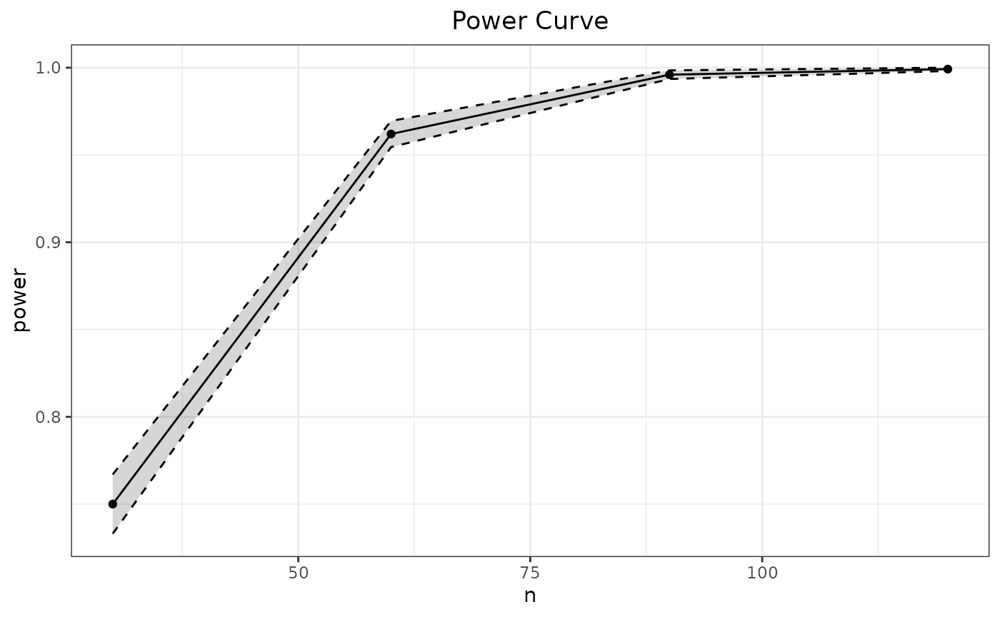
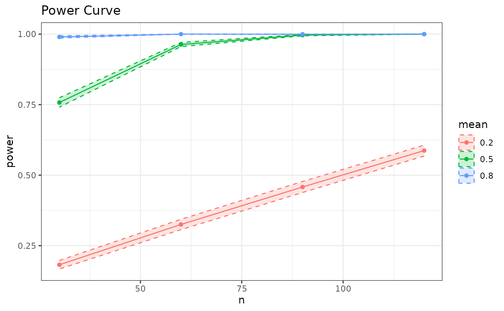

# Introduction to the Spower package

This vignette provides a brief introduction to using the package
`Spower` for prospective/post-hoc, a priori, sensitivity, criterion, and
compromise power analyses. For a more detailed description of the
package structure and philosophy please refer to associated publication
(Chalmers, 2025), as well as the documentation found within the
functions; particularly,
[`Spower()`](https://philchalmers.github.io/Spower/reference/Spower.md),
[`SpowerBatch()`](https://philchalmers.github.io/Spower/reference/Spower.md),
and
[`SpowerCurve()`](https://philchalmers.github.io/Spower/reference/Spower.md).

## Types of functions

There are generally two ways to go about using `Spower`. The first is by
utilizing one of a handful of **build-in simulation experiments** with
an associated data-generation and analysis, or more flexibility (but
less user friendly) by constructing a **user-defined simulation
experiment** by way of writing simulation code that is encapsulated
inside a single function. In either case, the goal is to design R code
to perform a given simulation experiment with a set of meaningful (often
scalar) functional arguments, where the output from this function
returns either:

1.  A suitable $p$-value under the null hypothesis statistical testing
    (NHST) paradigm, $P\left( D|H_{0} \right)$,
2.  The posterior probability of a (typically alternative) hypothesis,
    $P\left( H_{1}|D \right)$, or
3.  A logical value indicating support for the hypothesis of interest

For the first two cases, the $p$ value returned is compared to a
suitable cut-off defined by the package (e.g., is $p$ less than
$\alpha = .05$ for the first option, while the second might be $p$
greater than $\alpha.95$), and therefore converted to a `TRUE/FALSE`
value internally, while the ladder does not require such a
transformation. In all cases, the average of the resulting
`TRUE`/`FALSE` values reflects something to do with statistical power
(e.g., `TRUE` if rejecting the null; `TRUE` if supporting the
alternative; some more complicated combination involving precision,
multiple hypotheses, regions of practical equivalence/significance,
etc), thereby forming the basis for all subsequent power analysis
procedures.

The internal functions available in `Spower` primarily focuses on the
first approach criteria involving NHST $p$-values, as this is
historically the most common in similar software (e.g., *GPower 3*),
however nothing precludes `Spower` from more complex and interesting
power analyses. See the vignette *“Logical Vectors, Bayesian power
analyses and ROPEs”* for more advanced examples involving confidence
intervals (CIs), parameter precision criterion, regions of practical
equivalences (ROPEs), equivalence tests, Bayes Factors, and power
analyses involving posterior probabilities. See also the vignette *“Type
S and Type M errors”* for conditional power evaluation information to
estimate sign (S) and magnitude (M) power information and their
respective Type S and Type M errors (Gelman and Carlin, 2014).

### Built-in simulation experiments

`Spower` ships with several common statistical inference experiments,
such as those involving linear regression models, mediation analyses,
ANOVAs, $t$-tests, correlations, and so on. The simulation experiments
are organized with the prefix `p_`, followed by the name of the analysis
method. For instance,

``` r
p_lm.R2(50, k=3, R2=.3)
```

    ## [1] 0.004935905

performs a single simulation experiment reflecting the null hypothesis
$H_{0}:\, R^{2} = 0$ for a linear regression model with $k = 3$
predictor variables and a sample size of $N = 50$.

Translating this information into a power analysis context now simply
requires passing this experiment to
[`Spower()`](https://philchalmers.github.io/Spower/reference/Spower.md)
(the details of which are discussed below), where by default the
estimate of power ($1 - \widehat{\beta}$) is returned using the default
`sig.level = .05`.

``` r
p_lm.R2(50, k=3, R2=.3) |> Spower() 
```

    ## 
    ## Execution time (H:M:S): 00:00:41
    ## Design conditions: 
    ## 
    ## # A tibble: 1 × 5
    ##       n    R2     k sig.level power
    ##   <dbl> <dbl> <dbl>     <dbl> <lgl>
    ## 1    50   0.3     3      0.05 NA   
    ## 
    ## Estimate of power: 0.971
    ## 95% Confidence Interval: [0.968, 0.974]

Each of the `p_*` functions return a $p$-value ($P(D|H_{0}$) as this is
the general information required to evaluate statistical power with
[`Spower()`](https://philchalmers.github.io/Spower/reference/Spower.md).
Alternatively, users may define their own simulation functions if the
desired experiment has not been defined within the package.

### User-defined simulation experiments

As a very simple example, suppose one were interested in the power to
reject the null hypothesis $H_{0}:\,\mu = \mu_{0}$ in a one-sample
$t$-test scenario, where $P\left( D|H_{0} \right)$ is the probability of
the data given the null hypothesis of interest. Note that while the
package already supports this type of analysis (see
[`help(p_t.test)`](https://philchalmers.github.io/Spower/reference/p_t.test.md))
it is instructive to see how users they can write their own version of
this experiment, as this will help in defining simulations outside what
is currently included in the package.

``` r
p_single.t <- function(n, mean, mu=0){
    g <- rnorm(n, mean=mean)
    p <- t.test(g, mu=mu)$p.value
    p
}
```

This simulation experiment will first obtain sample of data drawn from a
Gaussian distribution with some specific `mean` ($\mu$), and evaluate
the conditional probability that the data were generated from a
population with a $\mu_{0} = 0$ (the null; hence,
$P\left( D|\mu_{0} = 0 \right)$). As such, the $p$-value returned from
this experiments reflects the probability of observing the data given
the null hypothesis $H_{0}:\,\mu = \mu_{0}$, or more specifically
$H_{0}:\,\mu = 0$, for a single generated dataset.

``` r
# a single experiment
p_single.t(n=100, mean=.2)
```

    ## [1] 0.06328707

From here, a suitable cut-off is required to evaluate whether the
experiment was ‘significant’, which is the purpose of the parameter
$\alpha$. Specifically, if the observed data ($D$) were plausibly drawn
from a population with $\mu_{0}$ (hence,
$P\left( D|\mu_{0} \right) \geq \alpha$) then a `FALSE` significance
would be returned; otherwise, if the data were unlikely to have been
observed given the ($P\left( D|\mu_{0} = 0 \right) < \alpha$) then a
`TRUE` would be returned, thereby indicating statistical significance.

For convenience, and for the purpose of other types of specialized power
analyses (e.g., compromise analyses), the $\alpha$ parameter has been
controlled via the argument `Spower(..., sig.level = .05)`, which
creates the `TRUE/FALSE` evaluations internally. This saves a step in
the writing, but if users wished to defined `sig.level` within the
simulation experiment itself that is an acceptable approach too.

## Types of power analyses to evaluate

For power analyses there are typically four parameters that can be
manipulated/solved in a given experiment: the $\alpha$ level (Type I
error, often reflexively set to $\alpha = .05$), power (the complement
of the Type II error, $1 - \beta$), an effect size of interest, and the
sample size. Given three of these values, the fourth can always be
solved.

Note that the above description reflects a general rule-of-thumb, as
there may be multiple effect sizes of interest, multiple sample size
definitions (e.g., in the form of cluster sizes in multi-level models),
and so on. Regardless, in
[`Spower()`](https://philchalmers.github.io/Spower/reference/Spower.md)
switching between these types of power analysis criteria is performed
simply by explicitly specifying which parameter is missing (`NA`), as
demonstrated below, and therefore specific naming conventions for the
type of analysis being performed is not particularly important, though
the following presentation may be instructive nonetheless.

### Prospective/post-hoc power analysis

The canonical setup for
[`Spower()`](https://philchalmers.github.io/Spower/reference/Spower.md)
will evaluate prospective or post-hoc power, thereby obtaining the
estimate $1 - \widehat{\beta}$. By default,
[`Spower()`](https://philchalmers.github.io/Spower/reference/Spower.md)
uses $10,000$ independent simulation `replications` to estimate the
power when this is the target criterion.

Given the above simulation definition, the following provides an
estimate of power given the null hypothesis $H_{0}:\,\mu = 0.3$ given
that the data were generated from a distribution with $\mu = .5$ with
$n = 100$.

``` r
p_single.t(n=100, mean=.5, mu=.3) |> Spower() -> prospective
prospective
```

    ## 
    ## Execution time (H:M:S): 00:00:03
    ## Design conditions: 
    ## 
    ## # A tibble: 1 × 5
    ##       n  mean    mu sig.level power
    ##   <dbl> <dbl> <dbl>     <dbl> <lgl>
    ## 1   100   0.5   0.3      0.05 NA   
    ## 
    ## Estimate of power: 0.515
    ## 95% Confidence Interval: [0.505, 0.525]

### Compromise power analysis

Compromise power analysis involves manipulating the $\alpha$ level until
some sufficient balance between the Type I and Type II error rates are
met, expressed in terms of the ratio $q = \frac{\beta}{\alpha}$.

In `Spower`, there are two ways to approach this criterion. The first,
which focuses on the `beta_alpha` ratio at the outset, requires passing
the target ratio to
[`Spower()`](https://philchalmers.github.io/Spower/reference/Spower.md)
using the same setup as the previous prospective power analysis.

``` r
p_single.t(n=100, mean=.5, mu=.3) |> 
    Spower(beta_alpha=4) -> compromise
compromise
```

    ## 
    ## Execution time (H:M:S): 00:00:03
    ## Design conditions: 
    ## 
    ## # A tibble: 1 × 6
    ##       n  mean    mu sig.level power beta_alpha
    ##   <dbl> <dbl> <dbl>     <dbl> <lgl>      <dbl>
    ## 1   100   0.5   0.3        NA NA             4
    ## 
    ## Estimate of Type I error rate (alpha/sig.level): 0.093
    ## 95% Confidence Interval: [0.087, 0.098]
    ## 
    ## Estimate of power (1-beta): 0.629
    ## 95% Confidence Interval: [0.620, 0.638]

This returns the estimated `sig.level` ($\widehat{\alpha}$) and
resulting $\widehat{\beta}$ that satisfies the target $q$ ratio
$q = \beta/\alpha = 4$.

``` r
# satisfies q = 4 ratio
with(compromise, (1 - power) / sig.level)
```

    ## [1] 4

The second way to perform a compromise analysis is to re-use a previous
evaluation of a prospective/post-hoc power analysis, as this contains
all the necessary information for obtaining the compromise estimates.

``` r
# using previous post-hoc/prospective power analysis
update(prospective, beta_alpha=4)
```

    ## 
    ## Execution time (H:M:S): 00:00:03
    ## Design conditions: 
    ## 
    ## # A tibble: 1 × 6
    ##       n  mean    mu sig.level power beta_alpha
    ##   <dbl> <dbl> <dbl>     <dbl> <lgl>      <dbl>
    ## 1   100   0.5   0.3        NA NA             4
    ## 
    ## Estimate of Type I error rate (alpha/sig.level): 0.093
    ## 95% Confidence Interval: [0.088, 0.099]
    ## 
    ## Estimate of power (1-beta): 0.627
    ## 95% Confidence Interval: [0.617, 0.636]

In either case, the use of S3 generic
[`update()`](https://rdrr.io/r/stats/update.html) function can be
beneficial as the stored result may be reused with alternative
`beta_alpha` values, thereby avoiding the need to estimate new
experimental data.

### A priori power analysis

The goal of a priori power analysis is generally to obtain the sample
size ($N$) associated with a specific power rate of interest (e.g.,
$1 - \beta = .90$), which is useful in the context of future data
collection planning.

To estimate the sample size using Monte Carlo simulation experiments,
[`Spower()`](https://philchalmers.github.io/Spower/reference/Spower.md)
performs stochastic root solving using the ProBABLI approach from the
`SimDesign` package (see
[`SimSolve()`](http://philchalmers.github.io/SimDesign/reference/SimSolve.md)),
and therefore requires a specific search `interval` to search within.
The width of the interval should reflect a plausible range where the
researcher believes the solution to lie, however this may be quite large
as well as ProBABLI is less influenced by the range of the search
interval (Chalmers, 2024). Moreover, as the algorithm is fundamentally
based on bisections, the *midpoint* of the specified `interval` should
be organized to reflect the researcher’s “best guess” of where the
solution is likely to be, though this is generally only worth
considering if the simulation experiment under evaluation is very time
consuming.

Below the sample size `n` is solved to achieve a target power of
$1 - \beta = .80$, where the solution for $N$ was suspected to lie
somewhere between the search `interval = c(20, 200)`, with the initial
starting guess of $\widehat{N} = (20 + 200)/2 = 110$ (quite far from the
true solution, but in this case adds little to the overall computation
time).

``` r
p_single.t(n=NA, mean=.5) |> 
    Spower(power=.8, interval=c(20,200))
```

    ## 
    ## Execution time (H:M:S): 00:00:25
    ## Design conditions: 
    ## 
    ## # A tibble: 1 × 4
    ##       n  mean sig.level power
    ##   <dbl> <dbl>     <dbl> <dbl>
    ## 1    NA   0.5      0.05   0.8
    ## 
    ## Estimate of n: 32.8
    ## 95% Predicted Confidence Interval: [32.4, 33.1]

Equivalently, rather than placing the `interval` definition within
[`Spower()`](https://philchalmers.github.io/Spower/reference/Spower.md)
and providing a suitable `NA` placeholder to indicate which argument
`interval` pertains to, the function
[`interval()`](https://philchalmers.github.io/Spower/reference/Spower.md)
can be used directly in the experiment definition argument. Hence, the
following will be identical to the above example, though requires less
back-and-forth reading between the pipe seperator.

``` r
p_single.t(n=interval(20, 200), mean=.5) |> Spower(power=.8)
```

    ## 
    ## Execution time (H:M:S): 00:00:25
    ## Design conditions: 
    ## 
    ## # A tibble: 1 × 4
    ##       n  mean sig.level power
    ##   <dbl> <dbl>     <dbl> <dbl>
    ## 1    NA   0.5      0.05   0.8
    ## 
    ## Estimate of n: 32.8
    ## 95% Predicted Confidence Interval: [32.4, 33.1]

Of course, the output will still be presented in terms of the `NA`
placeholder logic, however in this case the user does not need to
specify the `NA` explicitly as it is clear from context.

### Sensitivity power analysis

Similar to a priori power analysis, in that stochastic root solving is
required, the target of sensitivity analysis is to locate some specific
standardized or unstandardized effect size that will result in a
particular power rate. This pertains to the question of how large an
effect size must be in order to reliably detect the effect of interest,
holding constant other information such as sample size.

Below the sample size is fixed at $N = 100$, while the interval for the
standardized effect size $d$ is searched between `c(.1, 3)`. Note that
the use of decimals in the interval tells
[`Spower()`](https://philchalmers.github.io/Spower/reference/Spower.md)
to use a continuous rather than discrete search space (cf. with a
priori, which uses an integer search space for the simulation
replicates).

``` r
p_single.t(n=100, mean=NA) |> 
    Spower(power=.8, interval=c(.1, 3))
```

    ## 
    ## Execution time (H:M:S): 00:00:20
    ## Design conditions: 
    ## 
    ## # A tibble: 1 × 4
    ##       n  mean sig.level power
    ##   <dbl> <dbl>     <dbl> <dbl>
    ## 1   100    NA      0.05   0.8
    ## 
    ## Estimate of mean: 0.281
    ## 95% Predicted Confidence Interval: [0.280, 0.283]

Equivalently, using
[`interval()`](https://philchalmers.github.io/Spower/reference/Spower.md)
(not run).

``` r
# p_single.t(n=100, mean=interval(.1, 3)) |> Spower(power=.8)
```

### Criterion power analysis

Finally, in criterion power analysis the goal is to locate the
associated $\alpha$ level (`sig.level`) required to achieve a target
power output holding constant the other modeling information. This is
done in
[`Spower()`](https://philchalmers.github.io/Spower/reference/Spower.md)
by setting the `sig.level` input to `NA` while providing values for the
other parameters. Note that technically no search interval is require in
this context as $\alpha$ necessarily lies between the interval
$\lbrack 0,1\rbrack$.

``` r
p_single.t(n=50, mean=.5) |> 
    Spower(power=.8, sig.level=NA)
```

    ## 
    ## Execution time (H:M:S): 00:00:17
    ## Design conditions: 
    ## 
    ## # A tibble: 1 × 4
    ##       n  mean sig.level power
    ##   <dbl> <dbl>     <dbl> <dbl>
    ## 1    50   0.5        NA   0.8
    ## 
    ## Estimate of sig.level: 0.010
    ## 95% Predicted Confidence Interval: [0.009, 0.010]

## Multiple power evaluation functions

The following functions,
[`SpowerBatch()`](https://philchalmers.github.io/Spower/reference/Spower.md)
and
[`SpowerCurve()`](https://philchalmers.github.io/Spower/reference/Spower.md),
can be used to evaluate and visualize power analysis results across a
range of inputs rather than a single set of fixed inputs. This section
demonstrates their general usage, as their specifications slightly
differ from that of
[`Spower()`](https://philchalmers.github.io/Spower/reference/Spower.md),
despite the fact that
[`Spower()`](https://philchalmers.github.io/Spower/reference/Spower.md)
is the underlying estimation engine.

### SpowerBatch()

To begin, suppose that there were interest in evaluating the
`p_single.t()` function across multiple $n$ inputs to obtain estimates
of $1 - \beta$. While this could be performed using independent calls to
[`Spower()`](https://philchalmers.github.io/Spower/reference/Spower.md),
the function
[`SpowerBatch()`](https://philchalmers.github.io/Spower/reference/Spower.md)
can be used instead, where the variable inputs can be specified in a
suitable vector format.

For instance, given the effect size $\mu = .5$, what would the power be
to reject the null hypothesis $H_{0}:\,\mu = 0$ across three different
sample sizes, $N = \lbrack 30,60,90\rbrack$?

``` r
p_single.t(mean=.5) |> 
    SpowerBatch(n=c(30, 60, 90)) -> prospective.batch
prospective.batch
```

    ## $CONDITION_1
    ## 
    ## Execution time (H:M:S): 00:00:03
    ## Design conditions: 
    ## 
    ## # A tibble: 1 × 4
    ##       n  mean sig.level power
    ##   <dbl> <dbl>     <dbl> <lgl>
    ## 1    30   0.5      0.05 NA   
    ## 
    ## Estimate of power: 0.752
    ## 95% Confidence Interval: [0.743, 0.760]
    ## 
    ## $CONDITION_2
    ## 
    ## Execution time (H:M:S): 00:00:03
    ## Design conditions: 
    ## 
    ## # A tibble: 1 × 4
    ##       n  mean sig.level power
    ##   <dbl> <dbl>     <dbl> <lgl>
    ## 1    60   0.5      0.05 NA   
    ## 
    ## Estimate of power: 0.967
    ## 95% Confidence Interval: [0.963, 0.970]
    ## 
    ## $CONDITION_3
    ## 
    ## Execution time (H:M:S): 00:00:03
    ## Design conditions: 
    ## 
    ## # A tibble: 1 × 4
    ##       n  mean sig.level power
    ##   <dbl> <dbl>     <dbl> <lgl>
    ## 1    90   0.5      0.05 NA   
    ## 
    ## Estimate of power: 0.996
    ## 95% Confidence Interval: [0.995, 0.997]

This can further be coerced to a `data.frame` object if there is reason
to do so (e.g., for plotting purposes, though see also
[`SpowerCurve()`](https://philchalmers.github.io/Spower/reference/Spower.md)).

``` r
as.data.frame(prospective.batch)
```

    ##    n mean sig.level  power    CI_2.5   CI_97.5
    ## 1 30  0.5      0.05 0.7516 0.7431313 0.7600687
    ## 2 60  0.5      0.05 0.9669 0.9633937 0.9704063
    ## 3 90  0.5      0.05 0.9963 0.9951100 0.9974900

Similarly, if the were related to a priori analyses for sample size
planning then the inputs to
[`SpowerBatch()`](https://philchalmers.github.io/Spower/reference/Spower.md)
would be modified to set `n` to the missing quantity.

``` r
apriori.batch <- p_single.t(mean=.5, n=NA) |> 
    SpowerBatch(power=c(.7, .8, .9), interval=c(20, 200)) 
apriori.batch
```

    ## $CONDITION_1
    ## 
    ## Execution time (H:M:S): 00:00:41
    ## Design conditions: 
    ## 
    ## # A tibble: 1 × 4
    ##       n  mean sig.level power
    ##   <dbl> <dbl>     <dbl> <dbl>
    ## 1    NA   0.5      0.05   0.7
    ## 
    ## Estimate of n: 26.7
    ## 95% Predicted Confidence Interval: [26.5, 27.0]
    ## 
    ## $CONDITION_2
    ## 
    ## Execution time (H:M:S): 00:00:21
    ## Design conditions: 
    ## 
    ## # A tibble: 1 × 4
    ##       n  mean sig.level power
    ##   <dbl> <dbl>     <dbl> <dbl>
    ## 1    NA   0.5      0.05   0.8
    ## 
    ## Estimate of n: 33.3
    ## 95% Predicted Confidence Interval: [32.9, 33.7]
    ## 
    ## $CONDITION_3
    ## 
    ## Execution time (H:M:S): 00:00:33
    ## Design conditions: 
    ## 
    ## # A tibble: 1 × 4
    ##       n  mean sig.level power
    ##   <dbl> <dbl>     <dbl> <dbl>
    ## 1    NA   0.5      0.05   0.9
    ## 
    ## Estimate of n: 44.4
    ## 95% Predicted Confidence Interval: [43.8, 44.8]

``` r
as.data.frame(apriori.batch)
```

    ##          n mean sig.level power   CI_2.5  CI_97.5
    ## 1 26.71726  0.5      0.05   0.7 26.46683 26.96011
    ## 2 33.31082  0.5      0.05   0.8 32.90640 33.69844
    ## 3 44.36998  0.5      0.05   0.9 43.76155 44.84176

### SpowerCurve()

Often times researchers wish to visualize the results of power analyses
in the form of graphical representations. `Spower` supports various
types of visualizations through the function
[`SpowerCurve()`](https://philchalmers.github.io/Spower/reference/Spower.md),
which creates power curve plots of previously obtained results (e.g.,
via
[`SpowerBatch()`](https://philchalmers.github.io/Spower/reference/Spower.md))
or for to-be-explored inputs. Importantly, each graphic contains
estimates of the Monte Carlo sampling uncertainty to deter
over-interpretation of any resulting point-estimates.

To demonstrate, suppose one were interested in visualizing the power for
the running single-sample $t$ test across four different sample sizes,
$N = \lbrack 30,60,90,120\rbrack$. To do this requires passing the
simulation experiment and varying information to the function
[`SpowerCurve()`](https://philchalmers.github.io/Spower/reference/Spower.md),
which fills in the variable information to the supplied simulation
experiment and plots the resulting output.

``` r
p_single.t(mean=.5) |> 
    SpowerCurve(n=c(30, 60, 90, 120))
```



Alternatively, were the above information already evaluated using
[`SpowerBatch()`](https://philchalmers.github.io/Spower/reference/Spower.md)
then this `batch` object could be passed directly to
[`SpowerCurve()`](https://philchalmers.github.io/Spower/reference/Spower.md)’s
argument `batch`, thereby avoiding the need to re-evaluate the
simulation experiments.

``` r
# pass previous SpowerBatch() object
SpowerCurve(batch=batch)
```

[`SpowerCurve()`](https://philchalmers.github.io/Spower/reference/Spower.md)
will accept as many arguments as exists in the supplied simulation
experiment definition, however it will only provide aesthetic mappings
for the first three variable input specifications as anything past this
becomes more difficult to display automatically. Below is an example
that varies both the `n` input as well as the input `mean`, where the
first input appears on the $x$-axis while the second is mapped to the
default colour aesthetic in `ggplot2`.

``` r
p_single.t() |> 
    SpowerCurve(n=c(30, 60, 90, 120), mean=c(.2, .5, .8))
```


